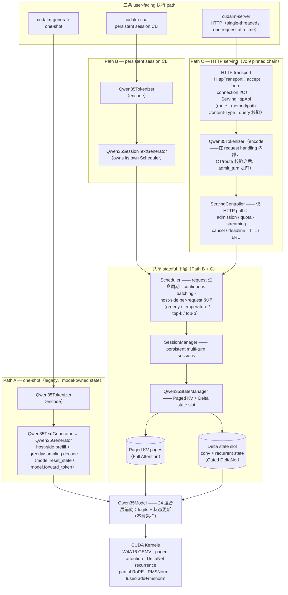

# CUDALM

原生 C++17/CUDA 量化大模型推理与 Serving 引擎

[English](README_EN.md)

CUDALM 是一个 **PyTorch-free 的 native C++17/CUDA 推理与 serving runtime**：它从官方
Qwen/Qwen3.5-0.8B-Base checkpoint 出发，用自实现的 weight 格式（W4A16 投影 + BF16 激活）、
自实现的 tokenizer、自实现的 CUDA kernel 完成完整的前向推理，并在其上实现了
**持久化多轮 Session、continuous batching 调度、commit-before-visible streaming、
取消 / deadline、TTL/LRU 驱逐和原生 HTTP frontend**。

它实现的模型是 **Qwen3.5-0.8B-Base**：24 层 decoder，**18 层 Gated DeltaNet（线性注意力）
+ 6 层 Full Attention** 的混合架构，hidden size 1024、head_dim 256、vocab 248320。
所有 projection GEMV 走 W4A16 量化路径（G=128 对称打包 int4 + fp16 scale），
激活与逐元素 kernel 走 BF16；DeltaNet 层持有持久的 conv state + recurrent state，
Full Attention 层持有 Paged KV cache。

**为什么它不仅是 kernel demo**：仓库里不是孤立的算子样例，而是一条从 checkpoint
到 serving 的完整链路——离线转换（Python 只存在于离线工具中，runtime 零 PyTorch /
零 Python 依赖，由 `scripts/check_no_torch.sh` 硬门禁保证）、单模型生成、持久多轮
会话、调度器驱动的真 batched decode、带 streaming / 取消 / 限流的 HTTP server，
以及配套的真实 checkpoint golden 测试、bit-exact 门禁、compute-sanitizer 验证和
exact-SHA 绑定的 benchmark 证据链。

**当前做到什么程度**：v1.0 是一个 **release-stable 的 portfolio 状态**——上述链路在
单机单卡（开发基线：RTX 2080 Ti / CUDA 11.8）上完整可运行、可测试、可复现；
性能文档（[性能与可复现性（中文）](docs/v10_performance_zh.md) /
[Performance (English)](docs/v10_performance.md)）与优化案例（v0.7
profile-driven optimization）全部绑定 exact SHA。它**不是**一个通用推理框架：
只支持 Qwen3.5-0.8B-Base 这一个模型、单 GPU、单 CUDA stream、raw-text
completion 语义（无官方 Qwen chat template、非 OpenAI 兼容）。

---

## 1. 项目简介 / Overview

CUDALM 的目标是把"一个 hybrid 架构的小模型如何在没有 PyTorch 的情况下被完整
推理并 serve"这个问题做成一个**工程上完整、证据上可核查**的参考实现：

- **推理正确性由 inference/runtime 层负责**：模型数学、tensor layout、状态管理、
  调度全部用 native C++17/CUDA 实现，用 pinned oracle 的 real-checkpoint
  golden 测试做显式容差数值验证，语义必须保持一致的路径再叠加
  bit-exact 硬门（见 §8）；
- **serving 策略由 serving/control 层负责**：一个独立的薄控制层
  （`ServingController`）在不修改 frozen runtime 的前提下叠加 admission / quota /
  streaming / cancel / deadline / TTL / LRU；
- **每一阶段都有 exact-SHA 绑定的证据**：性能、优化、修复结论都可以回溯到具体
  commit 与 raw 数据（见 `docs/provenance.md`）。

## 2. 核心能力 / Highlights

- 原生 C++17/CUDA Qwen3.5-0.8B 推理（**PyTorch-free production runtime**）
- W4A16 projection（G=128 对称 int4 + fp16 scale）+ BF16 activation
- 24 层混合模型：18× Gated DeltaNet + 6× Full Attention（partial RoPE、GQA、
  zero-centered RMSNorm、SwiGLU MLP）
- 原生 tokenizer（自研 CUDLMTK1 格式）+ greedy / temperature / top-k / top-p 采样
- Paged KV Cache（Full Attention）+ Delta conv/recurrent state pool（DeltaNet）
- **True batched decode**：decode cohort 走真 batched GPU path
  （`forward_batch_with_state`），不是 request loop 模拟 batch
- Continuous batching：多 request 动态到达、逐步组 cohort
- **持久化多轮 Session**：turn N 只追加并执行新输入，不重放历史 prompt
- Committed-token streaming（commit-before-visible）+ cancellation + deadline
- Admission / backpressure（session / request / context 限流，zero-mutation 拒绝）
- TTL / LRU-on-pressure session 驱逐
- Native HTTP frontend（`cudalm-server`，thin JSON/NDJSON 合同）
- Profile-driven CUDA 优化（v0.7：KEEP/REJECT 证据纪律，见 §7 与性能文档）

## 3. 系统架构 / Architecture

CUDALM 有**三条 user-facing 执行 path**（详见 [系统架构总览](docs/v10_architecture_overview.md)）。
**ServingController 只是 HTTP serving path 的策略边界，不是所有 CUDALM 执行模式
的通用 frontend 层**：



**HTTP path 的顺序要点**：HTTP request handling（transport accept →
`ServingHttpApi` 的 route / method/path / Content-Type / query 校验）
发生在 raw-text tokenization **之前**；tokenization 在
request-handling path 内部、admission 进 ServingController
**之前**完成（`ServingHttpApi::handle` 中
`codec->encode(req.body)` → `ctrl->admit_turn(...)`）。

组件职责与所属 path（"—" = 该 path 不经过此组件；`Qwen35Tokenizer`
是三条 path 共用的同一组件，CUDLMTK1 · raw text · 无 chat template，
只是在 Path C 中由 `ServingHttpApi` 在 request handling 内部调用）：

| 组件 | 职责 | A: generate | B: chat | C: server |
|---|---|---|---|---|
| Qwen35Tokenizer | encode / decode（raw text，无 template）；Path C 中在 ServingHttpApi 的 request handling 内调用 | ✓ | ✓ | ✓ |
| Qwen35TextGenerator → Qwen35Generator | one-shot prefill + host-side 采样 decode；**legacy model-owned state** | ✓ | — | — |
| Qwen35SessionTextGenerator | session CLI 的 text-in/text-out，owns 自己的 Scheduler | — | ✓ | — |
| HTTP transport / server loop（HttpTransport + server main） | bind / listen、single-threaded accept loop、connection I/O、one request at a time | — | — | ✓ |
| ServingHttpApi | routing、method/path + Content-Type 校验、query 解析、tokenizer codec encode/decode、ServingController 调用、JSON/NDJSON 响应与状态码 | — | — | ✓ |
| ServingController | serving policy：admission / quota / streaming / cancel / deadline / TTL / LRU | — | — | ✓ |
| Scheduler | request 生命周期、continuous batching、host-side per-request 采样 | — | ✓ | ✓ |
| SessionManager / Qwen35StateManager | session 与 per-sequence 状态（Paged KV + Delta slot）生命周期 | — | ✓ | ✓ |
| Qwen35Model + CUDA Kernels | 24 层混合前向 → logits + KV / Delta 状态更新（**采样不在此**） | ✓ | ✓ | ✓ |

## 4. 推理引擎实现 / What CUDALM Implements

**模型**（详细数学契约：`docs/qwen35_architecture.md`，本文不重复）：

- 24 层 decoder；Full Attention 在层 `{3, 7, 11, 15, 19, 23}`，其余 18 层为
  Gated DeltaNet；
- 每层全部 12 个 projection GEMV 为 W4A16（G=128 对称，q∈[-7,7]，fp16 scale，
  bf16 源）；layernorm / conv1d / embed 等非 GEMV 张量保留 BF16
  （两个张量按官方 checkpoint 以 FP32 直通）；
- Full Attention：q_proj 输出融合 [q; gate]、q/k 逐头 zero-centered RMSNorm、
  partial rotary（旋转维 64、theta=1e7）、GQA（8 query heads / 2 KV heads）、causal softmax(fp32)；
- Gated DeltaNet：in_proj_qkv/z/b/a → depthwise causal conv1d（k=4，持久 conv
  state）→ delta-rule 递推（持久 [16,128,128] FP32 recurrent state）→ gated
  RMSNorm → out_proj；
- 采样：greedy（默认）/ temperature / top-k / top-p（v0.4 冻结合同，HTTP 层
  精确镜像）。

**状态（session-bound path：`cudalm-chat` / `cudalm-server`）**：每个
live sequence 同时持有 (a) Full Attention 的 Paged KV 页（默认 2
tokens/page，可配）与 (b) DeltaNet 的 Delta slot（conv state +
recurrent state）。在 session-bound multi-turn / serving path 中，二者
统一绑定到 `SessionId → SequenceId` 生命周期；reset / destroy 以 Session
为生命周期边界：

```text
reset   → 状态清零（session id 不变，context 回到 0）
destroy → sequence retire → KV 页释放 → Delta slot 释放
multi-turn → 只追加并执行新输入，不重放历史 prompt
```

**状态（legacy one-shot path：`cudalm-generate`）**：`Qwen35Generator`
直接使用 model-owned 的 legacy state（`model.reset_state()` /
`model.forward_token()`），不经过 SessionManager / StateManager。两条
path 共享同一套冻结 kernel 与数学合同，external-state path 对 legacy
path 有 bit-exact parity 验证（要求完全一致的位置）。

**执行**：单 CUDA stream，prefill 串行，decode cohort 真 batch——
`forward_batch_with_state` 对同一 cohort 的 B 条 sequence 一次遍历 24 层
（B 个 logical token，1 次 model traversal）。

## 5. 快速开始 / Quick Start

依赖：CMake ≥ 3.16、CUDA 11.8（以本机工具链为准）、C++17 编译器、
官方 Qwen3.5-0.8B-Base checkpoint、Python（**仅离线转换工具使用**）。

```bash
# ---- build（runtime 与工具） ----------------------------------------------
cmake -S . -B build -DCMAKE_BUILD_TYPE=Release
cmake --build build -j

# ---- 一次性离线转换（Python 只在这里出现）---------------------------------
python3 tools/convert_qwen35.py --full-model \
    --checkpoint-dir /path/to/Qwen3.5-0.8B-Base \
    --out build/data/qwen35_08b_full.cudalm
python3 tools/convert_qwen35_tokenizer.py \
    --tokenizer-dir /path/to/Qwen3.5-0.8B-Base \
    --out build/data/qwen35_tokenizer.cudaltk
```

## 6. 文本生成 / Multi-turn / HTTP 示例

### 6.1 原生一次性生成（`cudalm-generate`）

```bash
build/cudalm-generate \
    --model build/data/qwen35_08b_full.cudalm \
    --tokenizer build/data/qwen35_tokenizer.cudaltk \
    --prompt "Explain what a paged KV cache is." \
    --max-new-tokens 64
# 采样模式（任一采样参数出现即进入 sampling；省略 --temperature 默认 1.0）：
build/cudalm-generate ... --temperature 0.8 --top-k 40 --top-p 0.9 --seed 42
# --greedy 与 --temperature/--top-k/--top-p 互斥
```

### 6.2 持久化多轮会话（`cudalm-chat`）

```bash
build/cudalm-chat \
    --model build/data/qwen35_08b_full.cudalm \
    --tokenizer build/data/qwen35_tokenizer.cudaltk
```

每行输入 **verbatim** 追加到同一个持久 Session（raw text，无 chat template、
无 special token、无分隔符）；turn N 从不重新编码或前向 turn 1..N-1。模型回复
在展示前已完整 commit 进该 Session 的 KV / Delta 状态。REPL 整行精确匹配
`reset`（清零，同一 session id）与 `quit`/`exit`（销毁退出）。

### 6.3 HTTP server（`cudalm-server`）

```bash
build/cudalm-server \
    --model build/data/qwen35_08b_full.cudalm \
    --tokenizer build/data/qwen35_tokenizer.cudaltk \
    --host 127.0.0.1 --port 8080 --slots 4 --pages 64
# 可选：--max-sessions N --max-live-requests N --session-ttl-ms N --lru-on-pressure
```

最典型的几条请求（turn 请求显式带 `Content-Type: text/plain`；完整合同、
错误码与 NDJSON 事件格式见 `docs/v09_serving_hardening.md`）：

```bash
curl -s http://127.0.0.1:8080/healthz
curl -s http://127.0.0.1:8080/v1/stats
curl -s -X POST http://127.0.0.1:8080/v1/sessions
# 返回 {"session_id":N} —— 下面的 1 换成实际返回的 id
curl -s -X POST -H 'Content-Type: text/plain' \
    --data "What is my name?" \
    "http://127.0.0.1:8080/v1/sessions/1/turn?max_new_tokens=32"
# 流式：NDJSON，逐 token 事件 + 终态事件（含完整 committed 文本）
curl -s -X POST -H 'Content-Type: text/plain' \
    --data "Why does paged KV matter?" \
    "http://127.0.0.1:8080/v1/sessions/1/turn/stream?max_new_tokens=32"
curl -s -X POST http://127.0.0.1:8080/v1/sessions/1/reset
curl -s -X DELETE http://127.0.0.1:8080/v1/sessions/1
```

turn 查询参数：`max_new_tokens`、`temperature`、`top_k`、`top_p`、`seed`、
`deadline_ms`（v0.4 采样合同，与 CLI 一致）。

## 7. 性能 / Performance

当前 release benchmark（canonical workload：4 requests、prompts 2/5/3/4、
generated 3/6/5/3、27 logical token-forwards、动态到达；warmup=2、measured=10；
证据 SHA `eeaef3e0b0cdd9b3dd808787e7b00f468f9b4b6a`）：

| 模式 | wall mean / median | logical tok/s (mean) | model traversals | avg / max decode batch |
|---|---|---|---|---|
| independent / serial | 132.707 / 131.392 ms | 203.46 | 27 | 0 / 0 |
| continuous batched | **116.064 / 115.457 ms** | **232.63** | 22 | 2.67 / 3 |
| batched-only serving profile | 110.017 ms | 245.42 | 22 | 2.67 / 3 |

同次实验（`--mode both`）serial→batched 观测差：**−16.64 ms（−12.5%）**。
**以上结果仅对应当前硬件、checkpoint 和 canonical workload**
（RTX 2080 Ti / CUDA 11.8），不代表通用性能提升。完整环境记录、per-run 数据、
复现流程与 v0.7 优化案例（profile-first、KEEP/REJECT 证据纪律：fused
residual-add + RMSNorm **KEEP**，−24 kernel launches/traversal，paired E2E
−1.238 ms，95% CI [−2.437, −0.040]；W4A16 与 DeltaNet 候选 **REJECT**）见：

- [性能与可复现性（中文）](docs/v10_performance_zh.md) ·
  [Performance (English)](docs/v10_performance.md)
- raw evidence：`benchmarks/v10/`（environment.txt + 两份 RAW 报告 + summary.json）

## 8. 正确性与工程验证 / Correctness & Validation

工程纪律（细节在各版本 sign-off 文档，README 不堆 per-version 测试数）：

- **Golden numerical correctness（tolerance-based）**：所有模型数学对照
  **pinned official / quantized oracle**（官方 Qwen3.5-0.8B-Base
  checkpoint，transformers 钉死在固定 commit；pins 记录在
  `docs/qwen35_architecture.md`），real-checkpoint golden 测试用**显式
  数值容差**（bf16 stage 容差、depth-aware full-model envelope）验证——
  不是与 oracle 的 bit-for-bit 相等；缺失 checkpoint 时 self-skip
  （ctest 77）；
- **Semantic parity（bit-exact where required）**：对必须完全保持行为
  一致的路径（external-state migration 对 frozen legacy path、paged-state
  parity、fused add+rmsnorm 对冻结 2-launch 序列、reset / interleave
  parity）使用 bit-exact / `memcmp` 硬门；
- **compute-sanitizer**：关键路径 0 error / 0 leak 验证记录；
- **no-PyTorch runtime guard**：`scripts/check_no_torch.sh` 对 `include/` +
  `src/` 硬扫描 torch / pybind 符号；
- **Session 交叉 / 断连 / fault 测试**：多 session 交叉、客户端断连清理、
  受控 destroy 失败注入（fail-loud）；
- **Bounded soak**：长时轮转压力脚本（e2e / disconnect / soak 三门禁）；
- **Exact-SHA benchmark provenance**：正式性能证据绑定 clean tree 的 exact
  SHA + binary sha256 + 环境记录（dirty tree fail-loud）。

v1.0 release validation（Phase D）分两层：

- **Hosted CI**（`.github/workflows/ci.yml` → `repository-checks`）→
  repository / static guards（no-PyTorch guard、shell/Python 语法、
  文档相对链接、conflict-marker hygiene）。**Hosted CI ≠ full GPU
  validation**——它不编译 CUDA、不跑 GPU 测试；
- **Local NVIDIA release validation**（本机 NVIDIA 环境，exact-SHA
  绑定）→ 完整 release build + full ctest（含 real-checkpoint
  GPU/integration 与 serving gates）+ 代表性
  `compute-sanitizer` gate。记录见
  `docs/v10_release_validation.md`。

## 9. 核心工程设计 / Engineering Decisions

**Hybrid State Management** — 在 session-bound multi-turn / serving path
（`cudalm-chat` / `cudalm-server`）中，Paged KV（Full Attention）与
Delta conv/recurrent state（DeltaNet）统一绑定到
`SessionId → SequenceId` 生命周期：admission 时分配、reset 时清零、
destroy 时释放；Session 是该 path 中资源与策略的单位。CUDALM 同时保留
frozen legacy one-shot / request-scoped execution path（`cudalm-generate`
的 model-owned state；`Scheduler::admit()` 的 request-scoped path），
因此 Session 不是整个引擎所有状态的唯一生命周期单位。

**True Batched Execution** — 调度器的 decode cohort 执行的是
`forward_batch_with_state` 真 batched GPU path（batched GEMV / paged
attention / DeltaNet 递推都按 B 条 sequence 一次执行），不是"对 B 个 request
循环跑 B 次单 forward"。canonical workload 上 27 个 logical token 只需
22 次 model traversal（3 个 committed batch 覆盖 8 个 batched token）。

**Commit-before-visible Streaming** — 硬约束：`sampled token != stream-visible
token`。token 只有在 forward 成功、进入 Session KV / Delta / position 之后
才能 emit；pending token 永不 emit（包括失败与取消）；EOS / max-new 的最后
token 先 emit 再报告 terminal；每 token exactly once、按顺序；serving 层
pull-based（只在 drive/poll 时 drain），不复制 generation loop。

**Evidence-driven Optimization** — 优化流程是 profile-first：先建 Nsight
baseline → 候选 → correctness（bit-exact 硬门禁）→ microbench → profiler →
paired E2E（pre-specified KEEP/REJECT 判据）。v0.7 的三个候选里两个被
REJECT——包括一个 kernel 隔离显著更快但 E2E 未过 gate 的 DeltaNet 候选。
**更快的 kernel 不代表更快的程序；最终以 E2E wall-clock gate 决策。**
（详见 §7 链接。）

## 10. 当前限制 / Limitations

- 仅支持 **Qwen3.5-0.8B-Base** 一个模型（单模型专用 runtime，不是通用框架）；
- 单 GPU、单 CUDA stream、prefill 串行；
- HTTP frontend：**single-threaded、一次一个 HTTP request**——底层 scheduler
  已支持 multi-request continuous batching，但不能把底层 batching 能力描述为
  concurrent HTTP serving；
- **raw-text completion 语义**：输入 verbatim 追加，**无官方 Qwen chat
  template、非 OpenAI-compatible**，也不是 ChatGPT-style conversation API；
- 无 tensor parallel / multi-GPU / speculative decoding / CUDA Graph /
  distributed serving；
- 无跨进程重启的持久 session 存储（session 状态只存在于进程内存）。

## 11. 仓库结构 / Repository Layout

```text
include/cudalm/   公共头文件：模型 / 状态 / 调度 / session / serving / tokenizer / weight 格式
src/kernels/      CUDA kernels（.cu）：W4A16 & bf16 GEMV、paged KV attention、DeltaNet、RoPE、RMSNorm、fused add+rmsnorm
src/runtime/      runtime（C++）：模型前向、state manager、scheduler、session、serving controller、weight/tokenizer loader
tools/            CLI（cudalm-generate / cudalm-chat / cudalm-server）、HTTP serving 公共代码、离线 Python 转换工具
tests/            CPU + GPU 测试门禁（无框架；缺 checkpoint self-skip）
benchmarks/       benchmark 程序 + 历史证据（v0.6 / v0.7 / v10，exact-SHA 绑定）
docs/             文档：provenance、架构契约、各版本 sign-off、性能
scripts/          guard（check_no_torch）、profiling / benchmark 工作流
```

## 12. 技术文档 / Documentation

- [系统架构总览（中文）](docs/v10_architecture_overview.md) ·
  [Architecture Overview (English)](docs/v10_architecture_overview_en.md)
- [性能与可复现性（中文）](docs/v10_performance_zh.md) ·
  [Performance (English)](docs/v10_performance.md)
- Qwen3.5 详细运行时契约（模型数学 / tensor layout / pins）→
  `docs/qwen35_architecture.md`
- Serving hardening（HTTP 合同 / streaming / cancel / deadline / TTL / LRU）→
  `docs/v09_serving_hardening.md`
- Multi-turn Session runtime → `docs/v08_session_runtime.md`
- v0.7 profile-guided optimization（profiling baseline / W4A16 / DeltaNet /
  final performance sign-off）→ `docs/v07_*.md`
- Weight / tokenizer 文件格式 → `docs/weight_format.md`
- 全版本 provenance（exact-SHA 证据链）→ `docs/provenance.md`
- v1.0 release 工作日志 → `docs/v10_release_notes.md`

## 13. Roadmap

- **v1.0**：portfolio / release stabilization（当前状态）。
- v1.0 后可能方向（**均为 future work，未开始**）：
  - 真正的并发 HTTP frontend（multi-client / 异步 accept）；
  - Qwen chat template / OpenAI-compatible adapter；
  - 更高级的 inference optimization（kernel 调优、更大 batch 形态等）。

---

License: MIT
