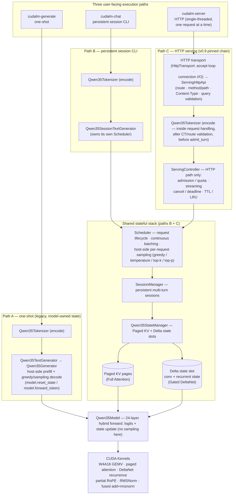

# CUDALM

A native C++17/CUDA quantized LLM inference & serving engine

[中文](README.md)

[](https://github.com/trump253/cudalm-agent/actions/workflows/ci.yml)

> The CI badge covers `repository-checks` (repository / static
> guards) only; full CUDA/checkpoint validation is the Local NVIDIA
> release validation (§8).

CUDALM is a **PyTorch-free, native C++17/CUDA inference and serving
runtime**. Starting from the official Qwen/Qwen3.5-0.8B-Base checkpoint,
it performs complete forward inference with its own weight format
(W4A16 projections + BF16 activations), its own tokenizer, and its own
CUDA kernels — and on top of that it implements **persistent multi-turn
sessions, a continuous-batching scheduler, commit-before-visible
streaming, cancellation / deadlines, TTL/LRU eviction, and a native
HTTP frontend**.

The model implemented is **Qwen3.5-0.8B-Base**: a 24-layer decoder with
a **hybrid 18× Gated DeltaNet (linear attention) + 6× Full Attention**
layout, hidden size 1024, head_dim 256, vocab 248320. Every projection
GEMV runs the W4A16 quantized path (G=128 symmetric packed int4 + fp16
scales); activations and elementwise kernels run BF16. DeltaNet layers
carry persistent conv state + recurrent state; Full Attention layers
carry a Paged KV cache.

**Why this is more than a kernel demo**: the repo is not a collection
of isolated operator samples — it is a complete checkpoint-to-serving
chain: offline conversion (Python exists only in the offline tools; the
runtime has zero PyTorch / zero Python dependency, enforced by the
`scripts/check_no_torch.sh` hard gate), single-model generation,
persistent multi-turn sessions, scheduler-driven true batched decode,
an HTTP server with streaming / cancellation / backpressure, plus
real-checkpoint golden tests, bit-exact gates, compute-sanitizer
verification, and an exact-SHA-bound benchmark evidence chain.

**Where it stands today**: v1.0 is a **release-stable portfolio
state** — the chain above runs end-to-end on a single machine / single
GPU (development baseline: RTX 2080 Ti / CUDA 11.8), is testable and
reproducible; the performance documentation
([Performance (English)](docs/v10_performance.md) /
[性能与可复现性（中文）](docs/v10_performance_zh.md)) and the
optimization case study (v0.7 profile-driven optimization) are all
bound to exact SHAs. It is **not** a general inference framework: one
model (Qwen3.5-0.8B-Base), single GPU, single CUDA stream, raw-text
completion semantics (no official Qwen chat template, not
OpenAI-compatible).

---

## 1. Overview

CUDALM's goal is to make "how a small hybrid-architecture model can be
fully inferred and served without PyTorch" into a **complete,
evidence-auditable reference implementation**:

- **Inference correctness is owned by the inference/runtime layer**:
  model math, tensor layouts, state management, and scheduling are all
  native C++17/CUDA, validated by real-checkpoint golden tests against
  the pinned oracle with explicit numerical tolerances, with bit-exact
  hard gates on the paths where semantic identity is required (see §8);
- **Serving policy is owned by the serving/control layer**: an
  independent thin control layer (`ServingController`) layers
  admission / quota / streaming / cancel / deadline / TTL / LRU on top
  without modifying the frozen runtime;
- **Every phase carries exact-SHA-bound evidence**: performance,
  optimization, and fix conclusions trace back to specific commits and
  raw data (see `docs/provenance.md`).

## 2. Highlights

- Native C++17/CUDA Qwen3.5-0.8B inference (**PyTorch-free
  production runtime**)
- W4A16 projections (G=128 symmetric int4 + fp16 scales) + BF16
  activations
- 24-layer hybrid model: 18× Gated DeltaNet + 6× Full Attention
  (partial RoPE, GQA, zero-centered RMSNorm, SwiGLU MLP)
- Native tokenizer (custom CUDLMTK1 format) + greedy / temperature /
  top-k / top-p sampling
- Paged KV Cache (Full Attention) + Delta conv/recurrent state pool
  (DeltaNet)
- **True batched decode**: decode cohorts take a real batched GPU path
  (`forward_batch_with_state`) — not a request loop simulating a batch
- Continuous batching: multiple requests with dynamic arrivals form
  cohorts step by step
- **Persistent multi-turn sessions**: turn N only appends and executes
  the new input — it never replays the historical prompt
- Committed-token streaming (commit-before-visible) + cancellation +
  deadlines
- Admission / backpressure (session / request / context limits,
  zero-mutation rejection)
- TTL / LRU-on-pressure session eviction
- Native HTTP frontend (`cudalm-server`, thin JSON/NDJSON contract)
- Profile-driven CUDA optimization (v0.7: KEEP/REJECT evidence
  discipline; see §7 and the performance docs)

## 3. Architecture

CUDALM has **three user-facing execution paths** (details in the
[Architecture Overview](docs/v10_architecture_overview_en.md)).
**ServingController is the policy boundary of the HTTP serving path —
not a universal frontend layer for every CUDALM execution mode**:



**HTTP path ordering note**: HTTP request handling (transport accept →
`ServingHttpApi`'s route / method-path / Content-Type / query
validation) happens **before** raw-text tokenization; tokenization
happens inside the request-handling path, **before** admission to the
ServingController (`codec->encode(req.body)` → `ctrl->admit_turn(...)`
inside `ServingHttpApi::handle`).

Component responsibilities and path membership ("—" = the path does not
go through this component; `Qwen35Tokenizer` is the same component
shared by all three paths — CUDLMTK1 · raw text · no chat template —
invoked on path C from inside `ServingHttpApi`'s request handling):

| component | responsibility | A: generate | B: chat | C: server |
|---|---|---|---|---|
| Qwen35Tokenizer | encode / decode (raw text, no template); on path C invoked inside ServingHttpApi's request handling | ✓ | ✓ | ✓ |
| Qwen35TextGenerator → Qwen35Generator | one-shot prefill + host-side sampling decode; **legacy model-owned state** | ✓ | — | — |
| Qwen35SessionTextGenerator | text-in / text-out for the session CLI; owns its own Scheduler | — | ✓ | — |
| HTTP transport / server loop (HttpTransport + server main) | bind / listen, single-threaded accept loop, connection I/O, one request at a time | — | — | ✓ |
| ServingHttpApi | routing, method/path + Content-Type validation, query parsing, tokenizer codec encode/decode, ServingController calls, JSON/NDJSON response & status codes | — | — | ✓ |
| ServingController | serving policy: admission / quota / streaming / cancel / deadline / TTL / LRU | — | — | ✓ |
| Scheduler | request lifecycle, continuous batching, host-side per-request sampling | — | ✓ | ✓ |
| SessionManager / Qwen35StateManager | session + per-sequence state (Paged KV + Delta slots) lifecycle | — | ✓ | ✓ |
| Qwen35Model + CUDA Kernels | the 24-layer hybrid forward → logits + KV / Delta state update (**no sampling here**) | ✓ | ✓ | ✓ |

## 4. What CUDALM Implements

**Model** (detailed math contracts: `docs/qwen35_architecture.md`, not
repeated here):

- 24 decoder layers; Full Attention at layers `{3, 7, 11, 15, 19, 23}`,
  the other 18 layers are Gated DeltaNet;
- every projection GEMV in every layer is W4A16 (G=128 symmetric,
  q∈[-7,7], fp16 scales, bf16 source); non-GEMV tensors (layernorms /
  conv1d / embedding) stay BF16 (two tensors pass through as FP32,
  exactly as in the official checkpoint);
- Full Attention: q_proj output fused as [q; gate], per-head
  zero-centered RMSNorm on q/k, partial rotary (rotation dim 64,
  theta=1e7), GQA (8 query heads / 2 KV heads), causal softmax in fp32;
- Gated DeltaNet: in_proj_qkv/z/b/a → depthwise causal conv1d (k=4,
  persistent conv state) → delta-rule recurrence (persistent
  [16,128,128] FP32 recurrent state) → gated RMSNorm → out_proj;
- Sampling: greedy (default) / temperature / top-k / top-p (the frozen
  v0.4 contract, mirrored exactly at the HTTP layer).

**State (session-bound paths: `cudalm-chat` / `cudalm-server`)**: every
live sequence simultaneously holds (a) Paged KV pages for the Full
Attention layers (default 2 tokens/page, configurable) and (b) a Delta
slot (conv state + recurrent state) for the DeltaNet layers. In the
session-bound multi-turn / serving path, both are owned by the
`SessionId → SequenceId` lifecycle; reset / destroy take the Session as
the lifecycle boundary:

```text
reset   → state cleared (same session id, context back to 0)
destroy → sequence retired → KV pages released → Delta slot released
multi-turn → only the new input is appended and executed — the
             historical prompt is never replayed
```

**State (legacy one-shot path: `cudalm-generate`)**: `Qwen35Generator`
uses the model-owned legacy state directly
(`model.reset_state()` / `model.forward_token()`) and does not go
through SessionManager / StateManager. Both paths share the same frozen
kernels and math contract; the external-state path is validated against
the frozen legacy path with bit-exact parity where required.

**Execution**: single CUDA stream, serial prefill, truly batched
decode — `forward_batch_with_state` walks the 24 layers once for a
cohort of B sequences (B logical tokens, ONE model traversal).

## 5. Quick Start

Dependencies: CMake ≥ 3.16, CUDA 11.8 (whatever your local toolchain
is), a C++17 compiler, the official Qwen3.5-0.8B-Base checkpoint, and
Python (**used only by the offline conversion tools**).

```bash
# ---- build (runtime + tools) ----------------------------------------------
cmake -S . -B build -DCMAKE_BUILD_TYPE=Release
cmake --build build -j

# ---- one-time offline conversion (this is where Python appears) -----------
python3 tools/convert_qwen35.py --full-model \
    --checkpoint-dir /path/to/Qwen3.5-0.8B-Base \
    --out build/data/qwen35_08b_full.cudalm
python3 tools/convert_qwen35_tokenizer.py \
    --tokenizer-dir /path/to/Qwen3.5-0.8B-Base \
    --out build/data/qwen35_tokenizer.cudaltk
```

## 6. Generation / Multi-turn / HTTP Examples

### 6.1 Native one-shot generation (`cudalm-generate`)

```bash
build/cudalm-generate \
    --model build/data/qwen35_08b_full.cudalm \
    --tokenizer build/data/qwen35_tokenizer.cudaltk \
    --prompt "Explain what a paged KV cache is." \
    --max-new-tokens 64
# sampling mode (any sampling flag present enters sampling; an omitted
# --temperature defaults to 1.0):
build/cudalm-generate ... --temperature 0.8 --top-k 40 --top-p 0.9 --seed 42
# --greedy is mutually exclusive with --temperature/--top-k/--top-p
```

### 6.2 Persistent multi-turn session (`cudalm-chat`)

```bash
build/cudalm-chat \
    --model build/data/qwen35_08b_full.cudalm \
    --tokenizer build/data/qwen35_tokenizer.cudaltk
```

Each input line is appended **verbatim** to the same persistent
session (raw text — no chat template, no special tokens, no separator);
turn N never re-encodes or re-forwards turns 1..N-1. The model response
is fully committed into the session's KV / Delta state before it is
shown. REPL commands are exact whole-line matches: `reset` (clear,
same session id) and `quit`/`exit` (destroy and leave).

### 6.3 HTTP server (`cudalm-server`)

```bash
build/cudalm-server \
    --model build/data/qwen35_08b_full.cudalm \
    --tokenizer build/data/qwen35_tokenizer.cudaltk \
    --host 127.0.0.1 --port 8080 --slots 4 --pages 64
# optional: --max-sessions N --max-live-requests N --session-ttl-ms N --lru-on-pressure
```

The typical requests (turn requests carry an explicit
`Content-Type: text/plain`; for the full contract, status codes, and
the NDJSON event format see `docs/v09_serving_hardening.md`):

```bash
curl -s http://127.0.0.1:8080/healthz
curl -s http://127.0.0.1:8080/v1/stats
curl -s -X POST http://127.0.0.1:8080/v1/sessions
# returns {"session_id":N} — replace 1 below with the actual id
curl -s -X POST -H 'Content-Type: text/plain' \
    --data "What is my name?" \
    "http://127.0.0.1:8080/v1/sessions/1/turn?max_new_tokens=32"
# streaming: NDJSON — one token event per committed token + a terminal
# event (carrying the full committed text)
curl -s -X POST -H 'Content-Type: text/plain' \
    --data "Why does paged KV matter?" \
    "http://127.0.0.1:8080/v1/sessions/1/turn/stream?max_new_tokens=32"
curl -s -X POST http://127.0.0.1:8080/v1/sessions/1/reset
curl -s -X DELETE http://127.0.0.1:8080/v1/sessions/1
```

Turn query parameters: `max_new_tokens`, `temperature`, `top_k`,
`top_p`, `seed`, `deadline_ms` (the v0.4 sampling contract, identical
to the CLI).

## 7. Performance

Current release benchmark (canonical workload: 4 requests, prompts
2/5/3/4, generated 3/6/5/3, 27 logical token-forwards, dynamic
arrivals; warmup=2, measured=10; evidence SHA
`eeaef3e0b0cdd9b3dd808787e7b00f468f9b4b6a`):

| mode | wall mean / median | logical tok/s (mean) | model traversals | avg / max decode batch |
|---|---|---|---|---|
| independent / serial | 132.707 / 131.392 ms | 203.46 | 27 | 0 / 0 |
| continuous batched | **116.064 / 115.457 ms** | **232.63** | 22 | 2.67 / 3 |
| batched-only serving profile | 110.017 ms | 245.42 | 22 | 2.67 / 3 |

Observed serial→batched delta in the same experiment (`--mode both`):
**−16.64 ms (−12.5%)**. **These results correspond only to the current
hardware, checkpoint, and canonical workload** (RTX 2080 Ti / CUDA
11.8) and are not a general performance improvement claim. Full
environment record, per-run data, the reproduction workflow, and the
v0.7 optimization case study (profile-first, KEEP/REJECT evidence
discipline: fused residual-add + RMSNorm **KEPT** —
−24 kernel launches/traversal, paired E2E −1.238 ms, 95% CI
[−2.437, −0.040]; the W4A16 and DeltaNet candidates **REJECTED**):

- [Performance & Reproducibility (English)](docs/v10_performance.md) ·
  [性能与可复现性（中文）](docs/v10_performance_zh.md)
- raw evidence: `benchmarks/v10/` (environment.txt + two RAW reports
  + summary.json)

## 8. Correctness & Validation

Engineering discipline (details live in the per-version sign-off
docs; the README does not stack per-version test counts):

- **Golden numerical correctness (tolerance-based)**: all model math
  is checked against the **pinned official / quantized oracle**
  (official Qwen3.5-0.8B-Base checkpoint, transformers pinned to a
  fixed commit; pins recorded in `docs/qwen35_architecture.md`);
  real-checkpoint golden tests use **explicit numerical tolerances**
  (bf16 stage tolerance, depth-aware full-model envelopes) — not
  bit-for-bit equality against the oracle; self-skip (ctest 77) when
  the checkpoint is absent;
- **Semantic parity (bit-exact where required)**: paths that must keep
  behavior exactly identical (external-state migration vs the frozen
  legacy path, paged-state parity, fused add+rmsnorm vs the frozen
  2-launch sequence, reset / interleave parity) use bit-exact /
  `memcmp` hard gates;
- **compute-sanitizer**: 0 error / 0 leak verification records for the
  critical paths;
- **no-PyTorch runtime guard**: `scripts/check_no_torch.sh` hard-scans
  `include/` + `src/` for torch / pybind symbols;
- **Session interleave / disconnect / fault tests**: multi-session
  interleaving, client-disconnect cleanup, controlled destroy-failure
  injection (fail loud);
- **Bounded soak**: long-running rotation stress scripts (e2e /
  disconnect / soak gates);
- **Exact-SHA benchmark provenance**: official performance evidence is
  bound to an exact SHA of a clean tree + binary sha256 + environment
  record (fail loud on a dirty tree).

v1.0 release validation (Phase D) is two-layered:

- **Hosted CI** (`.github/workflows/ci.yml` → `repository-checks`) →
  repository / static guards (no-PyTorch guard, shell/Python syntax,
  documentation relative links, conflict-marker hygiene).
  **Hosted CI is NOT full GPU validation** — it does not compile
  CUDA and does not run GPU tests;
- **Local NVIDIA release validation** (the release NVIDIA
  environment, exact-SHA bound) → full release build + full ctest
  (including real-checkpoint GPU/integration and serving gates) + a
  representative `compute-sanitizer` gate. Recorded in
  `docs/v10_release_validation.md`. v1.0 release validation:
  **84 passed / 0 skipped / 0 failed** (0 errors / 0 bytes leaked).

## 9. Engineering Decisions

**Hybrid State Management** — in the session-bound multi-turn /
serving paths (`cudalm-chat` / `cudalm-server`), Paged KV (Full
Attention) and Delta conv/recurrent state (DeltaNet) are owned by the
`SessionId → SequenceId` lifecycle: allocated on admission, zeroed on
reset, released on destroy; the Session is that path's unit of
resource and policy. CUDALM also retains the frozen legacy one-shot /
request-scoped execution paths (`cudalm-generate`'s model-owned
state; `Scheduler::admit()`'s request-scoped path), so the Session is
not the universal lifecycle unit for every runtime mode.

**True Batched Execution** — the scheduler's decode cohorts execute
`forward_batch_with_state`, a real batched GPU path (batched GEMV /
paged attention / DeltaNet recurrence all run over B sequences in one
go) — not "loop over B requests and run B single forwards". On the
canonical workload, 27 logical tokens need only 22 model traversals
(3 committed batches covering 8 batched tokens).

**Commit-before-visible Streaming** — hard invariant: `sampled token !=
stream-visible token`. A token is emitted only after its forward
succeeded and it entered the session's KV / Delta / position; the
pending token is never emitted (including on failure and cancel); the
final EOS / max-new token is emitted before the terminal is reported;
each token exactly once, in order; the serving layer is pull-based
(drain on drive/poll) and does not copy the generation loop.

**Evidence-driven Optimization** — the optimization flow is
profile-first: Nsight baseline → candidate → correctness (bit-exact
hard gate) → microbenchmark → profiler → paired E2E (pre-specified
KEEP/REJECT criteria). Two of v0.7's three candidates were REJECTED —
including a DeltaNet candidate whose kernels were clearly faster in
isolation but failed the E2E gate. **A faster kernel is not a faster
program; the E2E wall-clock gate is the final decision.** (See the §7
links.)

## 10. Limitations

- One model only: **Qwen3.5-0.8B-Base** (a single-model runtime, not a
  general framework);
- Single GPU, single CUDA stream, serial prefill;
- HTTP frontend: **single-threaded, one HTTP request at a time** — the
  underlying scheduler supports multi-request continuous batching, but
  that capability must not be described as concurrent HTTP serving;
- **Raw-text completion semantics**: input is appended verbatim — no
  official Qwen chat template, not OpenAI-compatible, and not a
  ChatGPT-style conversation API;
- No tensor parallel / multi-GPU / speculative decoding / CUDA Graph /
  distributed serving;
- No persistent session storage across process restarts (session state
  lives in process memory only).

## 11. Repository Layout

```text
include/cudalm/   public headers: model / state / scheduler / session / serving / tokenizer / weight format
src/kernels/      CUDA kernels (.cu): W4A16 & bf16 GEMV, paged KV attention, DeltaNet, RoPE, RMSNorm, fused add+rmsnorm
src/runtime/      runtime (C++): model forward, state manager, scheduler, sessions, serving controller, weight/tokenizer loaders
tools/            CLIs (cudalm-generate / cudalm-chat / cudalm-server), HTTP serving common code, offline Python conversion tools
tests/            CPU + GPU test gates (framework-free; self-skip without the checkpoint)
benchmarks/       benchmark programs + historical evidence (v0.6 / v0.7 / v10, exact-SHA bound)
docs/             documentation: provenance, architecture contracts, per-version sign-offs, performance
scripts/          guards (check_no_torch), profiling / benchmark workflows
```

## 12. Documentation

- [Architecture Overview (English)](docs/v10_architecture_overview_en.md) ·
  [系统架构总览（中文）](docs/v10_architecture_overview.md)
- [Performance & Reproducibility (English)](docs/v10_performance.md) ·
  [性能与可复现性（中文）](docs/v10_performance_zh.md)
- Qwen3.5 detailed runtime contracts (model math / tensor layouts /
  pins) → `docs/qwen35_architecture.md`
- Serving hardening (HTTP contract / streaming / cancel / deadline /
  TTL / LRU) → `docs/v09_serving_hardening.md`
- Multi-turn session runtime → `docs/v08_session_runtime.md`
- v0.7 profile-guided optimization (profiling baseline / W4A16 /
  DeltaNet / final performance sign-off) → `docs/v07_*.md`
- Weight / tokenizer file formats → `docs/weight_format.md`
- Full provenance (the exact-SHA evidence chain) →
  `docs/provenance.md`
- v1.0 release work log → `docs/v10_release_notes.md`

## 13. Roadmap

- **v1.0**: portfolio / release stabilization (current state).
- Possible post-v1.0 directions (**all future work, not started**):
  - a truly concurrent HTTP frontend (multi-client / async accept);
  - a Qwen chat template / OpenAI-compatible adapter;
  - more advanced inference optimization (kernel tuning, larger batch
    shapes, etc.).

---

License: MIT
