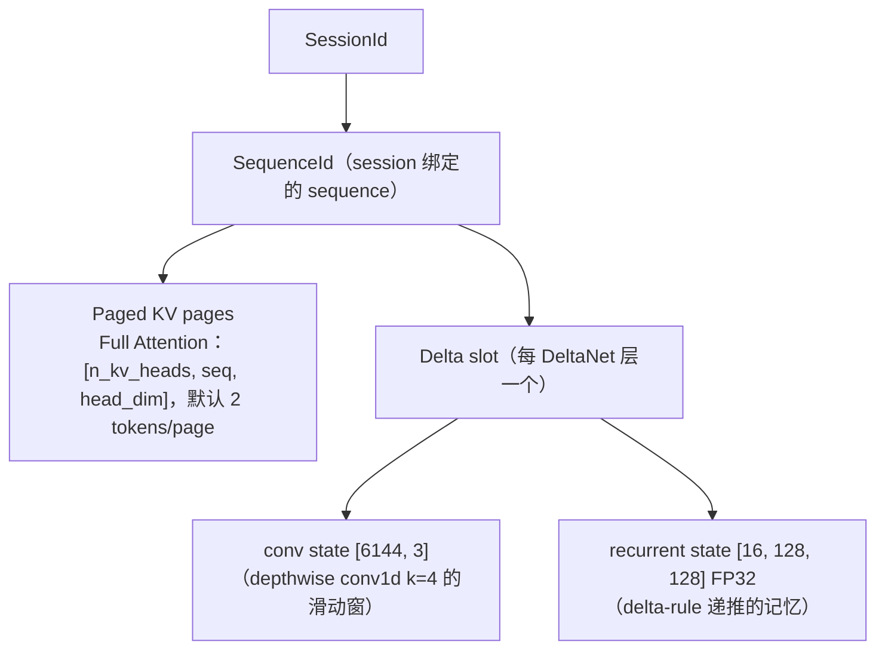
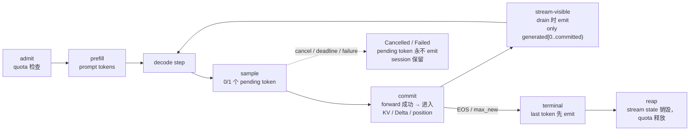

# CUDALM v1.0 — 系统架构总览

**面向**：面试官、新 contributor、想快速建立系统图景的 GitHub 读者。
本文是 **system design overview**（分层、边界、状态生命周期、serving
语义）；详细的模型数学 / tensor layout / 历史实现记录在
`qwen35_architecture.md`（frozen 契约），本文不复制它。代码、API、
identifier 一律使用原始英文。

---

## 1. 分层总览（Layer Stack）

```text
Frontend            CLI (cudalm-generate / cudalm-chat) + HTTP (cudalm-server)
      ↓
Serving control     ServingController —— admission / quota / streaming /
plane                       cancel / deadline / TTL / LRU（独立薄控制层）
      ↓
Scheduler           request 生命周期、continuous batching、batched decode 编排
      ↓
Session / state     SessionManager + Qwen35StateManager —— Session 与
                      per-sequence 状态（Paged KV + Delta slot）
      ↓
Model runtime       Qwen35Model —— 24 层混合前向、状态更新
      ↓
CUDA kernels        W4A16/bf16 GEMV · paged attention · DeltaNet 递推 ·
                    partial RoPE · RMSNorm · fused add+rmsnorm · batched 变体
      ↓
Artifacts           .cudalm v2（权重）+ .cudaltk（tokenizer）离线文件
```

各层职责与边界：

| 层 | 职责（owns） | 明确不负责 |
|---|---|---|
| Frontend | 协议与参数解析；CLI 的 REPL；HTTP 的 Content-Type 合同、JSON/NDJSON 编码、状态码映射 | 推理、serving 策略 |
| Tokenizer | encode / decode（raw text，自研 CUDLMTK1 格式） | 对话格式、chat template |
| **Serving control plane** | **policy**：admission（session/request/context 限流、zero-mutation 拒绝）、streaming 事件 drain（commit-before-visible）、cancel / deadline、TTL 扫描、LRU-on-pressure 驱逐、quota 生命周期 | 模型数学、调度内部、kernel |
| Scheduler | request 生命周期状态机（Waiting→Running→Finished/Cancelled/Failed）、动态到达、decode cohort 形成、驱动单 stream 上的 batched/单 forward | serving 策略、HTTP |
| Session / state | Session 的 create / reset / destroy；per-sequence 状态（KV 页 + Delta slot）的分配、清零、释放 | 请求准入、流控 |
| Model runtime + kernels | 24 层混合前向（B=1 与 B>1 两条 path）、KV / Delta 状态更新、采样（greedy/温度/top-k/top-p） | 并发、会话、网络 |
| Artifacts | 离线转换产物（Python 只存在于生成它们的工具中） | —— |

**核心边界原则：inference/runtime layer owns inference
correctness；serving/control layer owns policy。** serving 控制层是
v0.9 才加上去的薄层：它不修改 frozen runtime 的任何语义（调度、
状态、采样全部保持 v0.6–v0.8 冻结行为），只在其上叠加服务化策略。
这条边界让"serving 功能"与"推理正确性"的改动、测试、回归可以完全
分开。

## 2. 混合模型运行时（Hybrid Model Runtime）

Qwen3.5-0.8B-Base 是一个 **hybrid attention 架构**：24 层 decoder 中，
层 `{3, 7, 11, 15, 19, 23}` 是 Full Attention（GQA + partial RoPE +
q/k 逐头 zero-centered RMSNorm + [q;gate] 融合输出），其余 18 层是
**Gated DeltaNet**（线性注意力：depthwise causal conv1d(k=4) +
delta-rule 递推 + gated RMSNorm）。这意味着 runtime 必须同时管理两
类异构状态：Full Attention 的 **KV cache** 与 DeltaNet 的
**conv state + recurrent state**——这正是整个状态管理设计的出发点
（§3）。

数值路径：每层全部 12 个 projection GEMV 为 **W4A16**（G=128 对称
打包 int4，q∈[-7,7]，fp16 scale，bf16 源权重）；激活与逐元素 kernel
为 **BF16**；非 GEMV 张量按官方 checkpoint 原样保留（layernorm /
conv1d / embed 为 bf16，两个张量为 fp32 直通）。hidden size 1024、
head_dim 256、vocab 248320、eps 1e-6。

具体的逐层数学、tensor 形状表、RoPE / RMSNorm / delta-rule 的精确
契约、checkpoint 张量映射与 pins 在
`docs/qwen35_architecture.md`（frozen，本文不重复）。

## 3. 混合状态管理（Hybrid State Management）



状态归属规则（`Qwen35StateManager` 统一持有）：

- **allocation 在 admission**：session 创建时分配其 sequence 的全部
  状态（KV 页按用量增长 + Delta slot）；
- **reset = 持久状态清零**：`reset_session` 把 context 清回 0
  （KV 页内容作废、Delta 状态归零、position 归零），**session id
  不变**，session 保持 live；
- **destroy = sequence retire**：`destroy_session` 永久 retire 该
  sequence（SessionId 不复用）、释放全部 KV 页与 Delta slot、释放
  session 配额；
- **多轮 = 只追加**：turn N 只把新输入 append 到已有 context 并
  forward 新 token，**从不重放 turn 1..N-1 的 prompt**（见 §4）。

Full Attention 与 DeltaNet 的状态在同一个 sequence 生命周期下统一
管理，是 hybrid 架构 serving 的关键工程点：任何一层的状态泄漏或
错位都会同时破坏两种 attention 的正确性，而 session 是唯一的
生命周期单位，消除了"游离状态"。

## 4. 持久化多轮 Session（Multi-turn）

```text
Turn 1: "My name is Alice."
        │
        ▼
  输出 commit 进 KV + Delta state（context 增长）

Turn 2: "What is my name?"
        │
        ▼
  只 encode + forward 这一行的新 token
        │
        ▼
  从持久 state 继续 —— 模型"记得" Alice
```

语义要点（准确表述：**persistent multi-turn raw-text completion**）：

- 输入 **verbatim** 追加：无官方 Qwen chat template、无 special
  token、无分隔符——每行 raw text 就是模型看到的下一段；
- turn N 的执行成本与历史长度无关（不重放、不重编码历史）；
- 该语义 **不是** ChatGPT-style conversation API，也 **非
  OpenAI-compatible**；HTTP 与 CLI 共享同一套 session 语义。

## 5. Scheduler 与 Continuous Batching

`Scheduler` 管理多个 live request 的生命周期，支持 **动态到达**
（request 可以任意时刻 admit，不必同时开始）：

- 每步 `Scheduler::step()`：检查 deadline → 对可运行的 request 组
  decode cohort → 执行 forward → 采样；
- cohort 内 B>1 时走 **真 batched GPU path**
  （`forward_batch_with_state`：batched W4A16/bf16 GEMV、batched
  paged attention、batched DeltaNet 递推一次遍历 24 层），B=1 时走
  单 forward path；两条 path 的数学契约一致（有 parity 测试）；
- 一个 committed batch of B = B 个 logical token、**1 次 model
  traversal**——continuous batching 的收益就是 traversal 数的下降。

**诚实边界（必须强调）**：底层 scheduler 已支持 multi-request
continuous batching，但当前 **HTTP frontend 仍为 single-threaded、
one HTTP request at a time**（单线程 accept loop，一次处理一个
连接）。因此不能把底层 batching 能力描述为 concurrent HTTP serving：
HTTP 层的"并发"目前是 0，batching 收益通过直接驱动 scheduler 的
benchmark / 测试路径体现（见性能文档的 canonical workload）。

## 6. Request Lifecycle 与 Streaming 语义



**硬不变量：`sampled token != stream-visible token`。**

- 采样出的 token 是 **pending** 的：只有 forward 成功、token 已写入
  Session 的 KV / Delta / position 之后才 **committed**；
- **只有 `generated[0 .. committed_generated)` 可以暴露给客户端**；
  pending token 永不 emit——包括 forward failure 与 cancel 时；
- 每个 committed token **exactly once、按顺序** emit（serving 层的
  per-request `emitted_count` cursor，pull-based：只在 drive / poll
  的 drain 时可见，controller 从不 push）;
- **terminal final token 必须先 commit → 再 emit → 最后报告
  terminal**（frozen commit-then-stop 契约保证最后 token 先
  committed 才 terminal）；
- serving 层 **不复制 generation loop**：继续驱动 frozen
  `Scheduler::step()`（含 batched decode），只做 drain 与事件包装；
  多 request 同时 live 时各自 drain，事件连续、有序、无跨 request
  contamination。

这套 commit-before-visible 设计保证了客户端在任何时刻看到的文本都
与服务端持久 state **逐字节一致**——streaming 不会"先显示后撤销"。

## 7. Serving 控制平面（ServingController）

v0.9 的独立薄控制层（API 与合同细节：`docs/v09_serving_hardening.md`）：

- **ServingLimits**：`max_sessions` / `max_live_requests` /
  `max_context_length`（-1 = 不限）；
- **Backpressure（zero-mutation 拒绝）**：任何 admission 超限都
  返回冲突且**不改变任何状态**（不消耗 SessionId、不动计数器）；
- **Quota 生命周期**：session 配额 create→destroy；request 配额
  admit→terminal；live 数从追踪 id 推导（无计数器漂移路径）；
- **Streaming / cancel / deadline**：§6 的语义 + 请求级
  `deadline_ms`（scheduler step 间的 cooperative 边界，超时 →
  Cancelled + `deadline_exceeded`，同步 turn 映射 408）+
  `cancel`（立即释放 request 配额，**session 保留**）；
- **TTL / LRU 驱逐**：显式维护点（无后台线程/定时器）——TTL 扫描
  （idle ≥ TTL 即 eligible，TTL=0 表示 idle 即 eligible）与
  LRU-on-pressure（session 准入被限时按最久未活动驱逐 eligible
  session），均为 **fail-loud 三态合同**（真 destroy 失败 → 原
  Status 上抛、session 原样保留、扫描停止；无候选 ≠ 错误）。

## 8. 工程边界（如实记录）

- runtime（`include/` + `src/`）**零 PyTorch / 零 Python / 零第三方**
  依赖（`scripts/check_no_torch.sh` 硬门禁；HTTP 是手写 POSIX
  socket 薄层，无 libcurl/Boost/Asio/httplib）；
- 单 GPU、单 CUDA stream、prefill 串行；无 CUDA Graph / 无
  speculative decoding / 无 tensor parallel；
- tokenizer 与 weight 是离线产物（`.cudaltk` / `.cudalm v2`），
  Python 只存在于生成它们的 `tools/` 转换脚本中；
- 每阶段（v0.1 → v1.0）的 frozen 边界与证据 SHA 全部记录在
  `docs/provenance.md`。
