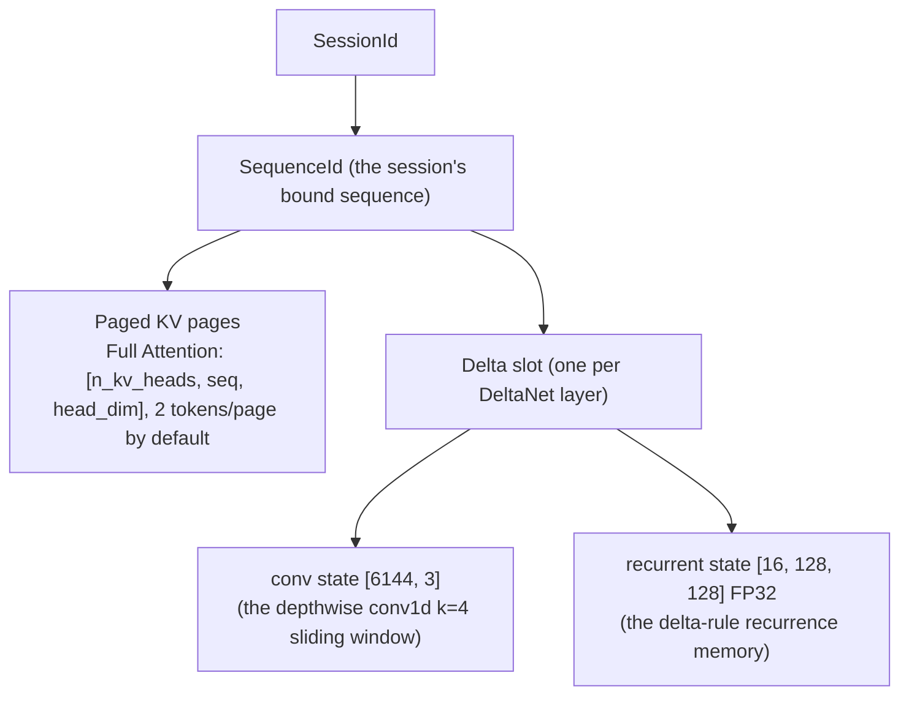
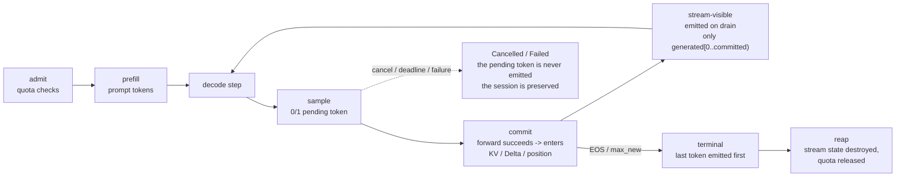

# CUDALM v1.0 — System Architecture Overview

**Audience**: interviewers, new contributors, GitHub readers who want
the system picture quickly. This is a **system design overview**
(layers, boundaries, state lifecycles, serving semantics). The
detailed model math / tensor layouts / historical implementation
record live in `qwen35_architecture.md` (the frozen contract); this
document deliberately does not repeat it. Code, API, and identifier
names stay in their original English.

---

## 1. Execution Paths & Layer Stack

**CUDALM has three user-facing execution paths** (all of them end at
`Qwen35Model → CUDA kernels`, but they go through different
components):

```text
Path A — one-shot generation (cudalm-generate)
    cudalm-generate
      → Qwen35Tokenizer
      → Qwen35TextGenerator → Qwen35Generator
            (host-side prefill + greedy/sampling decode)
      → Qwen35Model (legacy model-owned state:
                     model.reset_state / model.forward_token)
      → CUDA kernels
    (no ServingController / Scheduler / SessionManager / StateManager)

Path B — persistent session CLI (cudalm-chat)
    cudalm-chat
      → Qwen35Tokenizer
      → Qwen35SessionTextGenerator (owns its own Scheduler)
      → Scheduler → SessionManager → Qwen35StateManager
      → Qwen35Model
      → CUDA kernels
    (no ServingController)

Path C — HTTP serving (cudalm-server, the v0.9 pinned serving chain)
    cudalm-server (server main: single-threaded accept loop)
      → HTTP transport (HttpTransport: accept / read / send / close,
                        one connection/request at a time)
      → ServingHttpApi (route · method/path · Content-Type · query
                        validation)
      → Qwen35Tokenizer (encode — inside request handling, after
                         CT/route validation, before admission)
      → ServingController::admit_turn
      → Scheduler → SessionManager → Qwen35StateManager
      → Qwen35Model
      → CUDA kernels
    (HTTP request handling happens before raw-text tokenization;
     tokenization happens inside the request-handling path, before
     admission)
```

Shared lower-level component view (paths B and C share the stateful
stack below the Scheduler; path A drives the model directly with
model-owned state):

```text
Qwen35Tokenizer (shared by all three paths; raw text, no chat template;
                  on path C invoked inside ServingHttpApi's request
                  handling, before admission)
      ↓
Generation / scheduler layer   Qwen35Generator (path A) · Scheduler (B + C)
                               — host-side per-request sampling
                                 (greedy / temperature / top-k / top-p / seed)
      ↓
Session / state                SessionManager + Qwen35StateManager (B + C)
                               — Paged KV + Delta slots (session-bound)
      ↓
Model runtime                  Qwen35Model — the 24-layer hybrid forward →
                               logits + state update (no sampling here)
      ↓
CUDA kernels                   W4A16/bf16 GEMV · paged attention · DeltaNet
                               recurrence · partial RoPE · RMSNorm ·
                               fused add+rmsnorm · batched variants
      ↓
Artifacts                      .cudalm v2 (weights) + .cudaltk (tokenizer) offline files
```

**Key boundary: ServingController is the policy boundary of the HTTP
serving path — it is NOT a universal frontend layer for every CUDALM
execution mode.** `cudalm-generate` and `cudalm-chat` do not go
through it; it is an independent thin control layer layered onto path
C in v0.9.

Component responsibilities and boundaries:

| component | owns | appears in | explicitly does NOT own |
|---|---|---|---|
| Frontend (CLI entry points) | argument parsing & REPL (A/B); the server process entry point (C) | A, B, C | inference, serving policy |
| Qwen35Tokenizer | encode / decode (raw text, custom CUDLMTK1 format); on path C invoked from inside ServingHttpApi's request handling | A, B, C | conversation format, chat templates |
| Qwen35TextGenerator → Qwen35Generator | host-side prefill + sampling decode for one-shot; legacy model-owned state (`model.reset_state` / `model.forward_token`) | A only | sessions, policy |
| Qwen35SessionTextGenerator | text-in / text-out for the session CLI; **owns its own Scheduler** | B only | serving policy, HTTP |
| HTTP transport / server loop (HttpTransport + server main) | bind / listen, single-threaded accept loop, connection I/O (request reading), one connection/request at a time, send / close | C only | routing, codec, policy |
| ServingHttpApi | route handling, method/path validation, Content-Type validation, query parsing, raw-text codec encode/decode (invoking Qwen35Tokenizer), ServingController calls, HTTP status / JSON result mapping, NDJSON streaming event semantics | C only | connection I/O, policy |
| **ServingController** | **policy**: admission (session/request/context limits, zero-mutation rejection), streaming event draining (commit-before-visible), cancel / deadline, TTL sweeps, LRU-on-pressure eviction, quota lifecycles | **C only** | model math, scheduler internals, kernels |
| Scheduler | the request lifecycle state machine (Waiting→Running→Finished/Cancelled/Failed), dynamic arrivals, decode cohort formation, driving batched/single forwards on one stream | B, C | serving policy, HTTP |
| Session / state (SessionManager + Qwen35StateManager) | session create / reset / destroy; per-sequence state (Paged KV pages + Delta slots) allocation, zeroing, release | B, C | request admission, flow control |
| Model runtime + kernels | the 24-layer hybrid forward (B=1 and B>1 paths) → logits; KV / Delta state updates | A, B, C | sampling, concurrency, sessions, networking |
| Artifacts | offline conversion outputs (Python exists only in the tools that produce them) | — | — |

**Sampling is host-side generation/control logic**: the
`Qwen35Model` / CUDA kernels are responsible up to logits + state
update only; the greedy / temperature / top-k / top-p / seed token
selection is done on the host by `Qwen35Generator` (path A) or by the
Scheduler's per-request Sampler (paths B/C, sampling each logits row
after the forward). The CUDA kernels do not implement top-k/top-p.

**The core boundary principle: the inference/runtime layer owns
inference correctness; the serving/control layer owns policy.** The
serving control plane is a thin layer added in v0.9: it does not
modify any frozen runtime semantics (scheduling, state, and sampling
keep their v0.6–v0.8 frozen behavior) — it only layers serving
policy on top. That boundary keeps "serving features" and
"inference correctness" changes, tests, and regressions fully
separable.

## 2. Hybrid Model Runtime

Qwen3.5-0.8B-Base is a **hybrid attention architecture**: of its 24
decoder layers, layers `{3, 7, 11, 15, 19, 23}` are Full Attention
(GQA + partial RoPE + per-head zero-centered RMSNorm on q/k + fused
[q;gate] output), and the other 18 layers are **Gated DeltaNet**
(linear attention: depthwise causal conv1d (k=4) + delta-rule
recurrence + gated RMSNorm). The runtime must therefore manage two
kinds of heterogeneous state at once: the Full Attention **KV cache**
and the DeltaNet **conv state + recurrent state** — which is exactly
the starting point of the whole state-management design (§3).

Numeric path: every projection GEMV in every layer is **W4A16**
(G=128 symmetric packed int4, q∈[-7,7], fp16 scales, bf16 source
weights); activations and elementwise kernels are **BF16**; non-GEMV
tensors stay exactly as in the official checkpoint (layernorms /
conv1d / embedding are bf16, two tensors pass through as fp32).
Hidden size 1024, head_dim 256, vocab 248320, eps 1e-6.

The exact per-layer math, tensor shape tables, the precise RoPE /
RMSNorm / delta-rule contracts, the checkpoint tensor mapping, and
the pins are in `docs/qwen35_architecture.md` (frozen — not repeated
here).

## 3. Hybrid State Management

This section describes the **session-bound paths** (path B / C:
`cudalm-chat` / `cudalm-server`); the legacy one-shot path's state
model is covered at the end of the section.



State ownership rules (held uniformly by `Qwen35StateManager` in the
session-bound paths):

- **allocation on admission**: creating a session allocates all of
  its sequence's state (KV pages grow on demand + Delta slots);
- **reset = persistent state cleared to zero**: `reset_session`
  zeros the context (KV page contents invalidated, Delta state
  zeroed, position back to 0) — **the session id does not change**
  and the session stays live;
- **destroy = sequence retirement**: `destroy_session` retires the
  sequence forever (the SessionId is never reused), releases all KV
  pages and Delta slots, and frees the session quota;
- **multi-turn = append only**: turn N appends its new input to the
  existing context and forwards only the new tokens — **it never
  replays the prompts of turns 1..N-1** (see §4).

Full Attention and DeltaNet state live under one sequence lifecycle,
which is the key engineering point of serving a hybrid architecture:
any leak or misalignment in one kind of state would break both
attention types at once; within the session-bound paths, the session
is that path's single state-lifecycle boundary, so no state strays
outside a session.

### 3.1 Legacy vs external state (two state models)

CUDALM deliberately retains two state models (an important
engineering boundary):

```text
Legacy one-shot path (path A: cudalm-generate)
Qwen35Model
 ├─ owned KV state (held inside the model)
 └─ owned Delta state (held inside the model)
    API: model.reset_state() / model.forward_token()

Session-bound path (path B/C: cudalm-chat / cudalm-server)
SessionId
   ↓
SequenceId
   ├─ Paged KV pages (held by the StateManager)
   └─ Delta state slot (held by the StateManager)
    API: forward_token_with_state / forward_batch_with_state
```

Both paths share the same frozen kernels and math contract (the same
24-layer forward, the same quantized layouts). **The external-state
path was validated against the frozen legacy path with bit-exact
parity where required** (where exact identity is required: same token
stream, same frozen kernels, same op order → no tolerance,
memcmp), guaranteeing that moving the state outside the model
changes no numeric behavior. Therefore the Session is **not** the
universal lifecycle unit for every runtime mode: frozen legacy
one-shot / request-scoped execution paths (including the
`Scheduler::admit()` request-scoped path) still exist, and their
state does not hang off a Session.

## 4. Persistent Multi-turn Sessions

```text
Turn 1: "My name is Alice."
        |
        v
  the output is committed into the KV + Delta state (context grows)

Turn 2: "What is my name?"
        |
        v
  only this line's new tokens are encoded + forwarded
        |
        v
  execution continues from the persistent state — the model "remembers" Alice
```

Semantic points (the precise term: **persistent multi-turn raw-text
completion**):

- input is appended **verbatim**: no official Qwen chat template, no
  special tokens, no separators — each raw-text line is exactly what
  the model sees next;
- turn N's execution cost is independent of the history length (no
  replay, no re-encoding of history);
- this is **not** a ChatGPT-style conversation API and it is **not**
  OpenAI-compatible; the HTTP and CLI paths share the same session
  semantics.

## 5. Scheduler & Continuous Batching

`Scheduler` manages the lifecycles of multiple live requests and
supports **dynamic arrivals** (a request can be admitted at any time,
requests do not all start together):

- each `Scheduler::step()`: deadline checks → form the decode cohort
  of runnable requests → execute the forward → sample;
- when a cohort has B>1 it takes the **true batched GPU path**
  (`forward_batch_with_state`: batched W4A16/bf16 GEMV, batched
  paged attention, batched DeltaNet recurrence — one traversal of
  the 24 layers); when B=1 it takes the single-forward path; the two
  paths share one math contract (parity-tested);
- one committed batch of B = B logical tokens in **ONE model
  traversal** — the continuous-batching benefit is exactly the drop
  in traversal count.

**Honest boundary (must be stated)**: the underlying scheduler
supports multi-request continuous batching, but the current **HTTP
frontend is single-threaded, one HTTP request at a time** (a
single-threaded accept loop, one connection handled at a time). The
underlying batching capability must therefore NOT be described as
concurrent HTTP serving: the HTTP layer's concurrency is currently 0;
the batching benefit is demonstrated through the benchmark / test
paths that drive the scheduler directly (see the canonical workload
in the performance document).

## 6. Request Lifecycle & Streaming Semantics



**Hard invariant: `sampled token != stream-visible token`.**

- a sampled token is **pending**: it is **committed** only after its
  forward succeeded and it was written into the session's KV / Delta
  / position;
- **only `generated[0 .. committed_generated)` may be exposed to the
  client**; the pending token is never emitted — including on forward
  failure and on cancel;
- each committed token is emitted **exactly once, in order** (the
  serving layer's per-request `emitted_count` cursor; pull-based:
  visible only when drained on drive / poll — the controller never
  pushes);
- **the terminal final token must be committed → then emitted → and
  only then is the terminal reported** (the frozen commit-then-stop
  contract guarantees the last token is committed before the
  terminal);
- the serving layer does **not copy the generation loop**: it keeps
  driving the frozen `Scheduler::step()` (including batched decode)
  and only drains and wraps events; with multiple requests live,
  each is drained separately — events are contiguous, ordered, and
  free of cross-request contamination.

This commit-before-visible design guarantees that at any moment the
text a client has seen is **byte-for-byte consistent** with the
server's persistent state — streaming can never "show and then
unshow".

## 7. Serving Control Plane (ServingController)

The v0.9 independent thin control layer, **present only on the HTTP
serving path (path C)** — `cudalm-generate` / `cudalm-chat` do not go
through it (full API & contracts: `docs/v09_serving_hardening.md`):

- **ServingLimits**: `max_sessions` / `max_live_requests` /
  `max_context_length` (-1 = unlimited);
- **Backpressure (zero-mutation rejection)**: any over-limit
  admission returns a conflict and **mutates no state** (no SessionId
  consumed, no counters moved);
- **Quota lifecycles**: session quota create→destroy; request quota
  admit→terminal; live counts are derived from the tracked ids (no
  counter-drift path);
- **Streaming / cancel / deadline**: the §6 semantics + a per-request
  `deadline_ms` (a cooperative boundary between scheduler steps;
  expiry → Cancelled + `deadline_exceeded`, mapped to 408 on the
  synchronous turn) + `cancel` (frees the request quota
  immediately, **the session is preserved**);
- **TTL / LRU eviction**: explicit maintenance points (no background
  thread/timer) — the TTL sweep (eligible once idle for ≥ TTL;
  TTL=0 means eligible once idle) and LRU-on-pressure (evict the
  least-recently-used eligible session when session admission is
  limited); both are **fail-loud three-state contracts** (a real
  destroy failure → the original Status is propagated, the session is
  left exactly as it was, the sweep stops; no candidate ≠ error).

## 8. Engineering Boundaries (recorded honestly)

- the runtime (`include/` + `src/`) has **zero PyTorch / zero
  Python / zero third-party** dependencies (`scripts/check_no_
  torch.sh` hard gate; HTTP is a hand-written thin POSIX-socket
  layer — no libcurl/Boost/Asio/httplib);
- single GPU, single CUDA stream, serial prefill; no CUDA Graph / no
  speculative decoding / no tensor parallel;
- two stateful models coexist, both frozen contracts: the legacy
  model-owned state (one-shot path) and the external state
  (session-bound path); the latter is validated against the former
  with bit-exact parity (§3.1);
- the tokenizer and weights are offline artifacts (`.cudaltk` /
  `.cudalm v2`); Python exists only in the `tools/` conversion
  scripts that produce them;
- every phase's (v0.1 → v1.0) frozen boundaries and evidence SHAs are
  recorded in `docs/provenance.md`.
